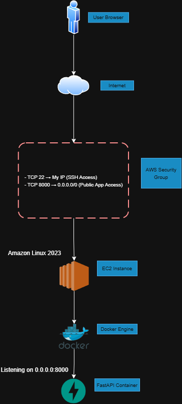

# 🚀 Cloud Deployment on AWS (EC2 + Docker + FastAPI)
## Overview:
This project demonstrates deploying a containerized FastAPI service to AWS EC2 (Free Tier) using Docker. The deployment includes Linux administration, security group configuration, container management, and structured troubleshooting.

The goal was to simulate a real-world support scenario involving cloud networking, service exposure, and log-based debugging. This project reuses the same FastAPI service from the Kubernetes mini-platform and deploys it directly on AWS EC2 to compare orchestration-based vs VM-based deployment models.
## 📂 Project Structure
```powershell
aws-ec2-docker-deployment/
│
├── app/
│   ├── main.py
│   └── requirements.txt
│
├── docker/
│   └── Dockerfile
│
├── docs/
│   └── screenshots
│
└── README.md
```
## Prerequisites:
* Windows + Powershell (Can also be done on Mac via Terminal)
* Docker Desktop
* Git
* AWS account
## Architecture:
Internet → AWS Security Group (Port 8000) → EC2 Instance (Amazon Linux) → Docker Container → FastAPI Application

## ⚙️ Tech Stack
* AWS EC2 (t2.micro or t3.micro – Free Tier)
* Amazon Linux 2023
* Docker
* FastAPI
* Uvicorn
* SSH
* Linux CLI
## Deployment Steps:
### Launch EC2 Instance
* AMI: Amazon Linux 2023
* Instance type: t3.micro (or t2.micro)
* Public IP enabled
* Security Group:
  * SSH (22) → My IP
  * TCP 8000 → 0.0.0.0/0
### SSH Into Instance
```powershell
ssh -i mini-ec2-key.pem ec2-user@<PUBLIC_IP>
```
### Install Docker
```powershell
sudo dnf update -y
sudo dnf install docker -y
sudo systemctl start docker
sudo systemctl enable docker
sudo usermod -aG docker ec2-user
```
### Clone Repository
```powershell
git clone https://github.com/zain1022/aws-ec2-docker-deployment.git
cd aws-ec2-docker-deployment
```
### Build and Run Container
```powershell
docker build -t mini-api:1.0 .
docker run -d --name mini-api -p 8000:8000 mini-api:1.0
```
### Verify Application
```powershell
curl http://localhost:8000/health
curl http://localhost:8000/items
```
## 🌐 Live Test

Once deployed, access:

```http://<PUBLIC_IP>:8000/health```  
```http://<PUBLIC_IP>:8000/items```

Example response:
```json
{ "status": "healthy" }
```
## 🛠️ Troubleshooting:
In case you run in to the any of the following errors or troubleshooting scenarios, here is a guide on how to solve these potential issues.
- If the site is not reachable:
 1. Verify EC2 instance is running
 2. Confirm Security Group allows TCP 8000
 3. Confirm container is running: ```docker ps```
 4. Check container logs: ```docker logs mini-api```
 5. Confirm application binds to ```0.0.0.0``` and not ```127.0.0.1```
* If container crashes:
```powershell
docker ps -a
docker logs mini-api
```
Fix issue → rebuild → redeploy:
```powershell
docker build -t mini-api:1.0 .
docker run -d -p 8000:8000 mini-api:1.0
```
#### 📊 Operational Commands Used:
```powershell
docker ps
docker logs
curl
sudo ss -lntp
ssh
```
## 🧠 Key Takeaways:
* Validated security group-based access control
* Diagnosed container-level failures via logs
* Differentiated networking issues from application-level issues
* Practiced structured, layered troubleshooting
## 🧹 Cleanup
To avoid charges:
* Stop container
* Terminate EC2 instance
* Delete unused volumes
## 🔍 Differences Between Local Kubernetes and EC2 Deployment
* Kubernetes = orchestrated, auto-healing
* EC2 = manual VM-level management
* Security groups vs Kubernetes services
* docker logs vs kubectl logs
## 🎯 What This Project Demonstrates
- SSH-based Linux administration
- Docker container lifecycle management
- Cloud networking and firewall configuration (Security Groups)
- Log-based debugging and issue isolation
- Production-style deployment workflow
